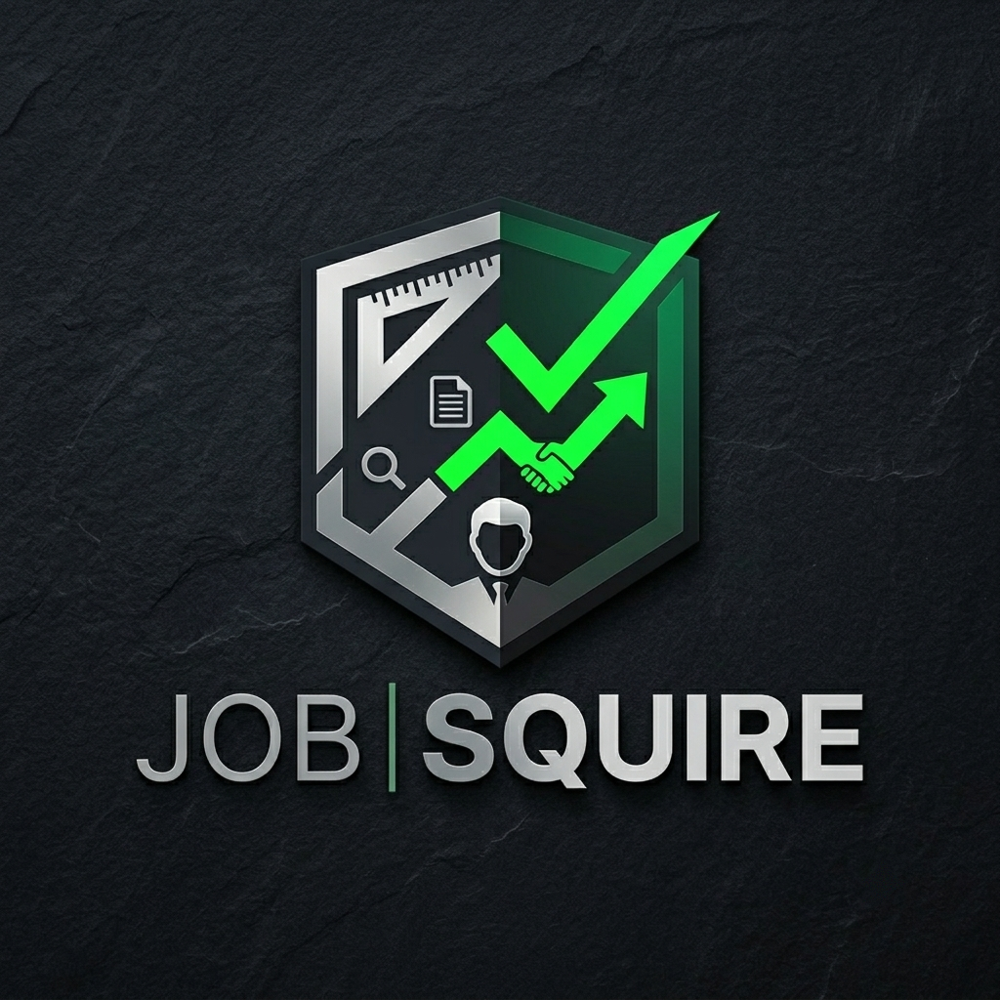

<p align="center">
  <picture>
    <source media="(prefers-color-scheme: dark)" srcset="app/static/JobSquire-Logo-DarkTheme.png">
    <source media="(prefers-color-scheme: light)" srcset="app/static/JobSquire-Logo-LightTheme.png">
    
  </picture>
</p>

# JobSquire

[](LICENSE.md)
[](https://www.python.org/)
[](https://github.com/dellipse/job-squire/pkgs/container/job-squire)

A self-hosted, two-user job-search assistant built with Flask + SQLite, packaged as a single Docker image run as three containers. It both **finds** new jobs automatically and **tracks** applications from first contact to offer. Claude integrates three ways: manual copy/paste, a direct Anthropic API call, or a live MCP connector.

> **Two-user design.** The app is built for exactly two trusted accounts: one admin (the operator) and one user (the job seeker). There is no public registration and it is not hardened for multi-tenant use. Keep it behind TLS and a reverse proxy.

**Full documentation is in [`docs/`](docs/README.md):** architecture, code reference, configuration, deployment runbook, MCP connector, and troubleshooting.

---

## Features

**Automated job search** runs on a configurable schedule (default: 8am, 1pm, 5pm weekdays in the search location's local time) across multiple job boards. Direct sources available in Settings → Sources — no separate setup beyond an API key: Dice (no key), Jobicy (no key), ZipRecruiter, Google Jobs via SerpApi (free tier, 250 searches/month), Adzuna, Jooble, USAJOBS, and The Muse. Google Jobs aggregates Indeed, LinkedIn, and hundreds of other boards in a single call. New postings are deduplicated and dropped into Job Squire as `Saved`; a digest email goes to the job seeker when anything new is found.

**Application tracking** follows a full hiring funnel:

`Saved > Applied > Phone Screen > Interview > Final Interview > Offer > Hired`

plus terminal states: `Rejected`, `Withdrawn`, `Ghosted`, `Pass`.

Other tracking features: interview debriefs (questions asked, self-rating, notes), per-job follow-up reminders, recruiter/contact log with submission tracking, file attachments per job, a timestamped activity log, and CSV export.

**AI integration** has three independent paths, all configurable in Settings → AI:

- **Manual** -- export JSON, analyze in any Claude, paste the result back. No setup required.
- **Automatic Features** -- configure one or more AI providers (Google Gemini, Groq, OpenRouter, Ollama, Mistral, OpenAI, Anthropic, and others); the app calls them directly on a schedule. Enables auto-triage after every search, daily follow-up drafts, and a weekly strategy review. Free tiers from Gemini, Groq, and OpenRouter are sufficient for typical use.
- **MCP connector** -- expose Job Squire as a custom connector. Any MCP-capable agent can read and write live: Claude Pro (via OAuth, no API key needed), Hermes Agent (static key, local agent loop), or OpenClaw (self-hosted gateway for chat-app access via Telegram, WhatsApp, etc.).

Automatic Features and the MCP connector are independent toggles — both can be active at the same time.

---

## Installation

**Linux and macOS — use the install script (recommended):**

```bash
curl -fsSL https://raw.githubusercontent.com/dellipse/job-squire/main/install.sh -o install.sh
bash install.sh
```

The script detects Docker or Podman (and installs one if neither is present), generates a secret key, prompts for passwords, and starts all three containers. Download the script before running rather than piping curl directly to bash — the script needs an interactive terminal for password prompts.

To reverse a completed install: `bash uninstall.sh` from the install directory. The script asks before removing anything and cleans up exactly what was created.

**Platform-specific guides** (manual setup, Windows, or native Python):

| Platform | Guide |
|---|---|
| Linux | [docs/install/linux.md](docs/install/linux.md) |
| macOS | [docs/install/macos.md](docs/install/macos.md) |
| Windows | [docs/install/windows.md](docs/install/windows.md) |

The manual quick start below assumes Linux with Docker already installed.

---

## Prerequisites

- Docker + Docker Compose (v2)
- A reverse proxy for TLS termination (SWAG / nginx). The compose file also supports direct host-port mode for local testing.
- Free API keys for one or more job sources (Adzuna + Jooble recommended as a starting pair)
- Optional: a free AI provider API key (Gemini, Groq, OpenRouter, etc.) or an Anthropic API key for API mode; Claude Pro for MCP mode

---

## Quick Start

```bash
# 1. Clone the repo
git clone https://github.com/dellipse/job-squire.git
cd job-squire

# 2. Create the data directory and copy the env template
mkdir -p data
cp examples/.env.example data/.env

# 3. Fill in required values (open data/.env in any editor)
#    Generate a SECRET_KEY:
python3 -c "import secrets; print(secrets.token_hex(32))"
#    Set: SECRET_KEY, ADMIN_PASSWORD (avoid $ in passwords)
#    Set USER_PASSWORD only if you need the second account

# 4. Start all three containers
docker compose up -d

# 5. Confirm startup
docker compose logs -f job-squire          # gunicorn up, accounts seeded
docker compose logs -f job-squire-worker   # "scheduler up ..."
docker compose logs -f job-squire-mcp      # uvicorn on :9000
```

The web app is available at `http://localhost:8080`. Sign in with `admin` and the password you set.

---

## Configuration

Configuration is split into two layers.

**Environment variables** live in `data/.env` and are loaded by all three containers at startup. The only required variables are `SECRET_KEY` and `ADMIN_PASSWORD`. See [`docs/configuration.md`](docs/configuration.md) for the full reference.

Key variables:

| Variable | Purpose |
|---|---|
| `SECRET_KEY` | Signs sessions and derives the Fernet encryption key for all stored secrets. Changing it invalidates saved API keys and passwords. |
| `ADMIN_PASSWORD` | Password for the admin account. Avoid `$` characters (or escape as `$$`). |
| `USER_PASSWORD` | Optional. Creates a second job-seeker account. Omit to run with admin only. |
| `SESSION_COOKIE_SECURE` | `true` behind HTTPS/SWAG; `false` for plain-HTTP local dev. |
| `PUBLIC_URL` | Base URL used in notification emails (e.g. `https://squire.yourdomain.com`). |
| `PUBLIC_MCP_URL` | Base URL for the MCP connector (enables MCP mode). |
| `SCHEDULE_WEEKDAY_HOURS` | Hours to run the search on weekdays (default `8,13,17`). |
| `INGEST_API_KEY` | Enables the `POST /api/ingest` endpoint. Leave blank to disable. |

**In-app settings** are entered on the Settings page after first login and stored encrypted in the database: job-source API keys, SMTP credentials, the Anthropic API key, search targets (job titles, location, radius), and the candidate profile.

---

## Deploying Behind SWAG

The default compose file publishes the web app on `127.0.0.1:8080` and the MCP server on `127.0.0.1:9000`. Any reverse proxy can reach them at those ports. For a **shared Docker network** with SWAG:

```bash
# Create the shared network once
docker network create swag

# In docker-compose.yml: comment out the `ports` blocks, uncomment the `networks` blocks
# Copy the sample proxy confs
cp examples/nginx/job-squire.subdomain.conf /path/to/swag/config/nginx/proxy-confs/
cp examples/nginx/mcp-squire.subdomain.conf /path/to/swag/config/nginx/proxy-confs/

docker compose up -d
docker exec swag nginx -t && docker exec swag nginx -s reload
```

Point `squire.<yourdomain>` and `mcp-squire.<yourdomain>` at the host. SWAG issues Let's Encrypt certs automatically. See [`docs/deployment.md`](docs/deployment.md) for the complete runbook.

To run more than one instance on the same host (e.g. one per job seeker), see [`docs/multi-instance.md`](docs/multi-instance.md).

---

## Local Dev (no Docker)

```bash
python -m venv .venv && source .venv/bin/activate
pip install -r requirements.txt

export SECRET_KEY=dev \
       ADMIN_PASSWORD=devpass \
       USER_PASSWORD=devpass \
       DATA_DIR=./data \
       SESSION_COOKIE_SECURE=false

python wsgi.py   # http://localhost:8000
```

---

## Turning on the Automated Search

1. Sign in and open **Settings > Sources**. Add API keys for at least one provider (Adzuna + Jooble is the recommended starting pair). Tick "Use this source" and save.
2. On the **Search** tab, set your target job titles and location. Location must be `City, ST` (e.g. `Austin, TX`).
3. On the **Email** tab, configure SMTP so the job seeker receives digest emails.
4. Click **Run search now** to test. New roles appear under the `Saved` status.

---

## AI Workflows

### Application Kit

Open any job and click **Application kit**. Download the generated Markdown file (it contains the candidate profile, the job posting, and a full step-by-step prompt) and paste it into Claude. Claude runs a fit assessment, researches the company and salary, does an ATS keyword pass, then returns a tailored resume, cover letter, application and follow-up emails, interview questions, and LinkedIn outreach.

In MCP mode, Claude can save the finished kit back to the job and set a follow-up reminder automatically.

### Pipeline Analysis

The **AI analysis** tab shows up to three options depending on what's configured — all can be active at once:

- **Manual** -- always available. Copy the provided prompt, attach the JSON export, paste the structured JSON result back.
- **Analyze now** -- shown when Automatic Features is enabled. Calls your configured AI providers in rank order and applies the result in one step. Thinking mode available for Anthropic.
- **Open in Claude** -- shown when the MCP connector is active. Claude reads the live pipeline and writes analysis back. The AI tab also displays five routine prompts (morning briefing, job triage, kit queue, follow-up drafts, weekly review) for use with Claude's scheduled tasks feature.

### MCP Connector Setup

1. Ensure `PUBLIC_MCP_URL=https://mcp-squire.<domain>` is set in `data/.env` and the `job-squire-mcp` container is running.
2. On **Settings → AI → MCP Connector**, enable the connector and note the connector URL and name.

**Claude Pro (OAuth):** In Claude, go to Settings → Connectors → Add custom connector. Paste the connector URL, give it the exact name shown in Settings, and authorize. **Open in Claude** buttons appear throughout the UI. No Anthropic API key required.

**Hermes Agent or other tools (static key):** Click **Generate static API key** in Settings → AI → MCP Connector. Configure the tool to send `Authorization: Bearer <key>` to your `PUBLIC_MCP_URL`. The Automatic Features toggle and the MCP connector are independent — both can be enabled at the same time.

The MCP server exposes 23 tools for reads and writes. See [`docs/mcp-connector.md`](docs/mcp-connector.md) for the full list.

---

## Backups

Everything is in the host data folder (`DATA_HOST_DIR`, defaulting to `./job-squire/data`): the SQLite database, uploads, and the candidate profile.

```bash
tar czf job-squire-backup-$(date +%F).tgz -C ./job-squire/data .
```

---

## Resetting a Password

Set the new value in `data/.env`, add `RESET_UIDS_AND_PWDS_ON_START=true`, restart (`docker compose up -d`), confirm login, then remove the flag and restart again.

---

## Repository Layout

```
job-squire/
  app/
    __init__.py       App factory, DB init, cross-process locking, migrations, seeding
    models.py         All SQLAlchemy models
    main.py           All UI + API routes
    auth.py           Login / logout blueprint
    ai.py             AI logic: payload, API calls, auto-triage, follow-up drafts, weekly review
    mcp_server.py     Remote MCP server (OAuth 2.0/PKCE, 23 tools)
    worker.py         APScheduler process
    providers.py      Job-board adapters: Dice, ZipRecruiter, Google Jobs (SerpApi), Adzuna, Jooble, USAJOBS, The Muse, Jobicy
    search.py         Search orchestration: dedup, ingest, cooldowns, email trigger
    notify.py         SMTP email: search digests, follow-up digests, weekly review
    prompts.py        Claude prompt templates for all five routines
    forms.py          WTForms definitions
    crypto.py         Fernet encryption for stored secrets
    timezones.py      "City, ST" to IANA timezone lookup for the scheduler
    extensions.py     Shared Flask extension singletons
    templates/        Jinja2 templates
    static/           CSS and JS (one file each; no inline JS -- CSP enforced)
  wsgi.py
  Dockerfile
  docker-compose.yml
  requirements.txt
  examples/
    .env.example              Template for data/.env
    nginx/                    Sample SWAG/nginx proxy-conf files
  docs/                       Full documentation
```

---

## Acknowledgements

Special thanks to C. Andrews, whose job search was the inspiration and proving ground for JobSquire. The features, workflows, and AI routines in this application were shaped by real-world use — and by the patience of someone willing to be the first guinea pig. This one's for you.

---

## License

[AGPL-3.0](LICENSE.md)
